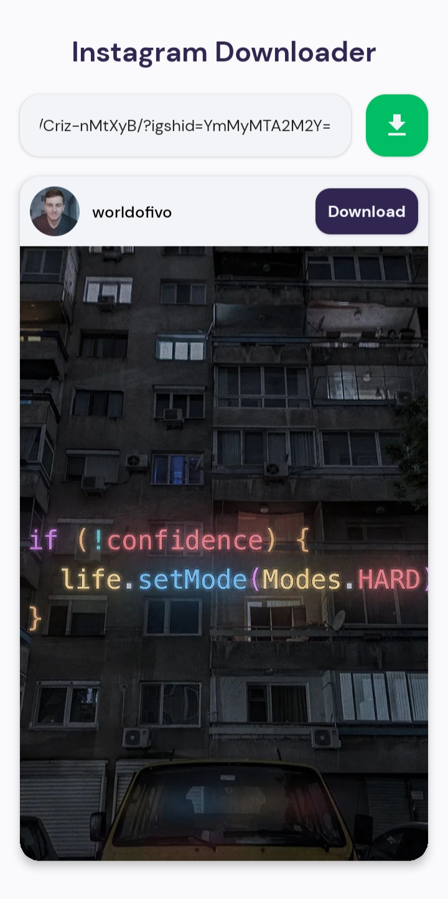
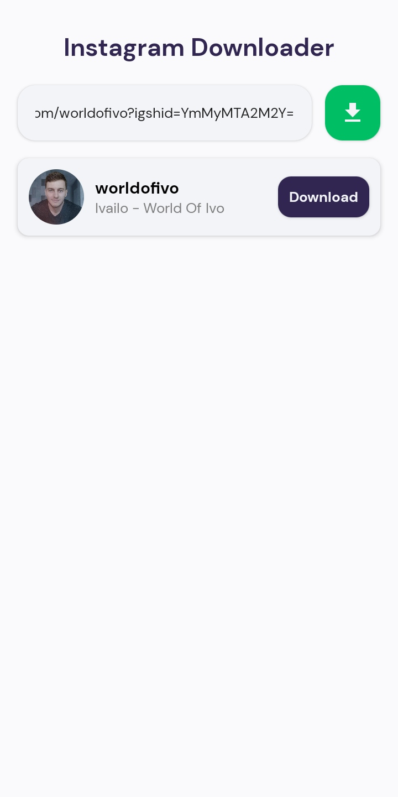

# Instagram Downloader

## Development
Clone the repository and run the following commands:
```
npm install
expo start
```

## ScreenShots
<div style="display: flex;justify-content: space-between">
    
    
</div>

## Links
- 📫 How to reach me **imadidaliouali@gmail.com**